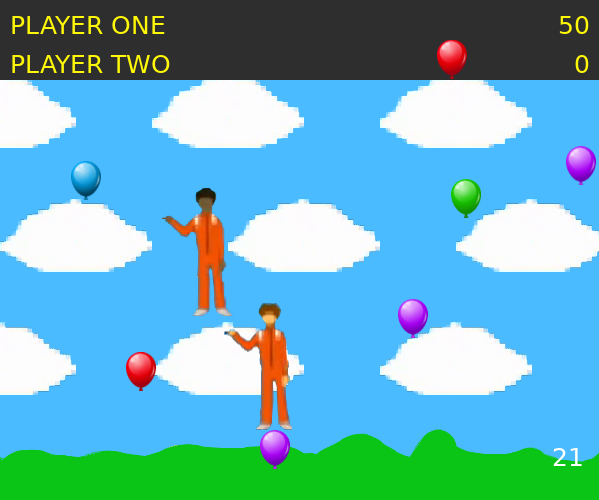
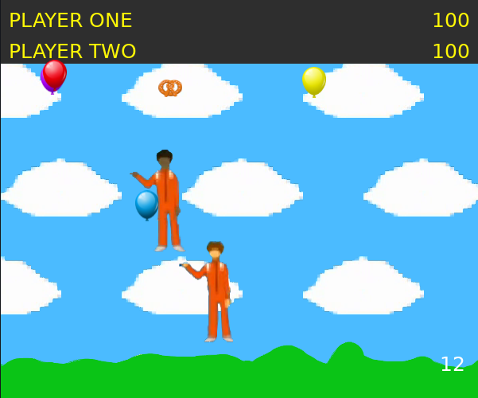

# Balloon Popper  
A simple one or two player 2D game based on the same game seen on Sealab2021. 
the objective is to pop more balloons than the other player. you should also try to collect the bonus pretzels. 

## ScreenShots  
  
  

## Controls  
at the start of the game:
 - press number + 'return' key to select the character you want to play as.  

#### Player One Controls
 - 'w,a,s,d' keys move player one around.

#### Player Two Controls  
 - 'up,down,left,right' keys move player two around.

at game over screen, press either 'r' or 'return' the restart and play again.  

## Requirements
 - [Love2D >= 0.10](https://love2d.org/)  

## Assets credits: 
##### balloon and pretzels: 
 - <a href="http://www.freepik.com">Designed by macrovector / Freepik</a>
 - <a href="https://www.freepik.com/free-vector/elements-oktoberfest-festival_911289.htm#query=pretzel&position=0&from_view=keyword&track=sph">Freepik</a>

##### Stormy,Quinn,and sound effects: 
 - Sealab2021  

##### Master Shake
 - AquaTeen Hunger Force

## External Libraries used:  

 - [tick](https://github.com/rxi/tick)